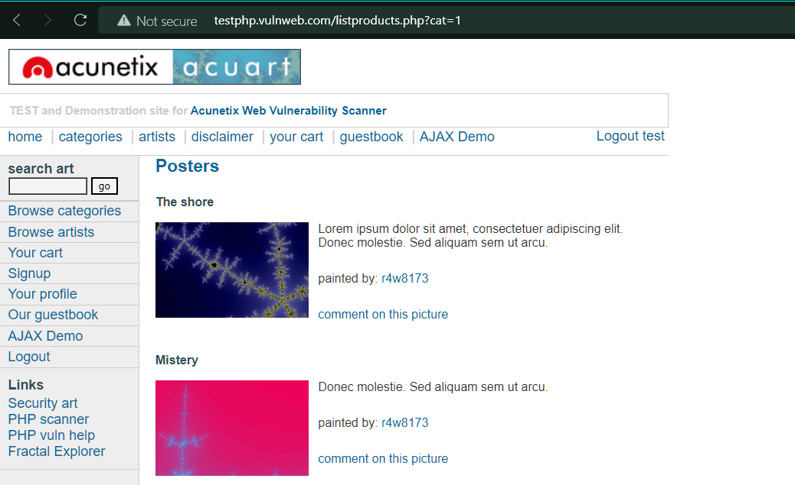
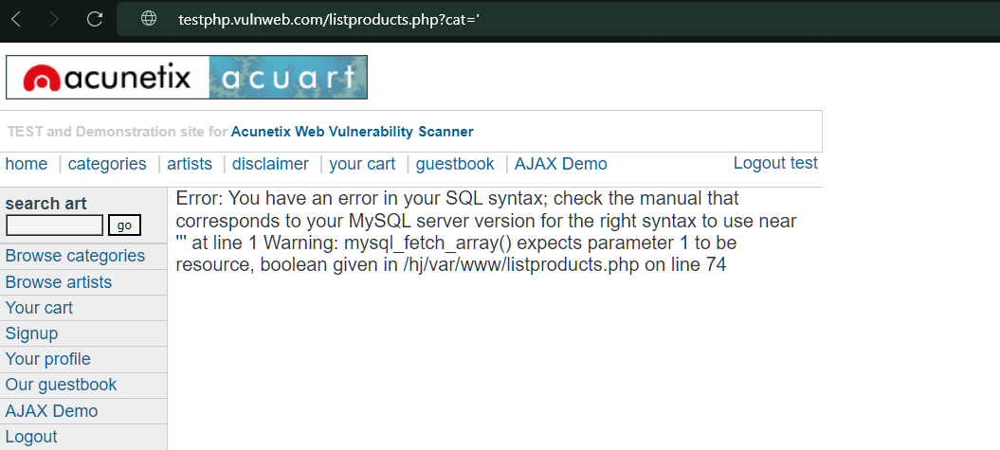

# How to Find

Find a vulnerable parameter to break out of the existing SQL Query. Add a _<mark style="color:blue;">`'`</mark>_or _<mark style="color:blue;">`"`</mark>_ as a closing quote. Watch out for the application's unexpected behaviour. The application may be susceptible to SQLi if it throws any errors.

We will take [_`http://testphp.vulnweb.com`_](http://testphp.vulnweb.com) as a vulnerable site, developed by acunetix.

Sign up with _<mark style="color:blue;">username: test</mark>_ & _<mark style="color:blue;">password: test</mark>_

Try inserting a quote or a double quote ( _' , "_ ) inside the parameter cat.

<figure><figcaption></figcaption></figure>

On inserting a quote inside the cat parameter we get an error, so it might be vulnerable to SQL Injection

<figure><figcaption></figcaption></figure>

You should test all the input fields on a website that could be connected to a database


There are types of SQL injection such as Blind SQL injection that require different techniques to detect.

